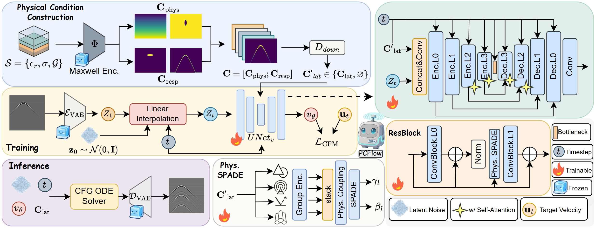
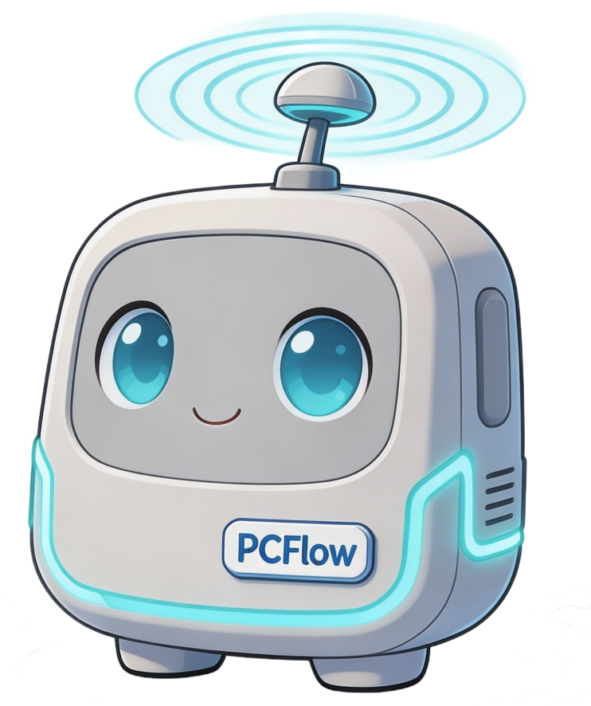

<div align="center">

# PCFlow

## Physics-Conditioned Flow Matching for GPR Pipeline Synthesis

[](#-paper)
[](#-paper)
[](LICENSE)
[](README.md) [](README_CN.md)

🔥 **PCFlow** is a framework for fast Ground-Penetrating Radar (GPR) B-scan synthesis, based on Maxwell-informed condition field-guided flow matching, achieving a unity of high visual fidelity and strong physical consistency.

<p float="center">
  
</p>

</div>

## 📋 Table of Contents

- [🚀 Quick Start](#-quick-start)
- [📦 Installation](#-installation)
- [🧠 Inference](#-inference)
- [🏋️ Training](#️-training)
- [📖 Paper](#-paper)

## 🚀 Quick Start

1️⃣ Clone the repository and enter the executable source directory

```bash
git clone https://github.com/GeometryFu/PCFlow.git
cd PCFlow
```

2️⃣ Create an environment and install dependencies

```bash
conda create -n pcflow python=3.10 -y
conda activate pcflow

# Install a CUDA-enabled PyTorch build suitable for your system first
pip install -r requirements.txt
```

3️⃣ Start training with the bundled dataset

```bash
python train.py \
    --model-config configs/model_gpr.yaml \
    --train-config configs/train_gpr.yaml
```

4️⃣ Run inference with a trained checkpoint 🎉

```bash
python sample.py \
    --ckpt outputs/gpr_cfm/checkpoints/ckpt_0050000.pt \
    --image dataset_split/images/test_id/steel_free_space_r0.08_eps10_sig0.005_x2.29_y0.65.png \
    --infile dataset_split/conditions/test_id/steel_free_space_r0.08_eps10_sig0.005_x2.29_y0.65.in \
    --out outputs/sample.png
```

📷 Example training output

```text
Resume disabled; training from scratch.
Step=50 | Total=...
[VAL] Step=1000 | ValLoss=... | ValMSE=...
Saved checkpoint at step 1000
```

## 📦 Installation

### Requirements

- Python >= 3.10
- PyTorch >= 2.1
- CUDA-capable GPU recommended

### Install

Choose the PyTorch build matching your CUDA environment from the [official PyTorch installer](https://pytorch.org/get-started/locally/), then install the project dependencies:

```bash
cd PCFlow
pip install -r requirements.txt
```

The frozen VAE is loaded from `stabilityai/sdxl-vae` by default. For offline use, download it in advance and set `vae.pretrained_path` in `configs/model_gpr.yaml` to its local directory.

### Verify Installation

```bash
python train.py --help
python sample.py --help
```

## 🧠 Inference

```bash
# Generate from an explicit image / gprMax .in pair
python sample.py \
    --model-config configs/model_gpr.yaml \
    --train-config configs/train_gpr.yaml \
    --ckpt outputs/gpr_cfm/checkpoints/ckpt_0050000.pt \
    --image path/to/reference.png \
    --infile path/to/scene.in \
    --out outputs/sample.png

# Or use the first paired record in a JSONL index
python sample.py \
    --ckpt outputs/gpr_cfm/checkpoints/ckpt_0050000.pt \
    --jsonl dataset_split/jsonl/test_id.jsonl \
    --out outputs/sample.png
```

The sampler rebuilds a physics condition from the scene, uses EMA weights when available, integrates the rectified-flow ODE with the configured Euler or Heun solver, and decodes the result through the SDXL VAE.

### Full Argument List

| Argument | Required | Default | Description |
| --- | --- | --- | --- |
| `--model-config` | No | `configs/model_gpr.yaml` | Model and physics-encoder configuration |
| `--train-config` | No | `configs/train_gpr.yaml` | Device, solver and sampling configuration |
| `--ckpt` | Yes | — | Trained `.pt` checkpoint |
| `--jsonl` | No | — | JSONL index; the current script reads its first record |
| `--image` | With `--infile` | — | Paired reference B-scan path required by the current CLI |
| `--infile` | With `--image` | — | gprMax-style physical scene file |
| `--out` | Yes | — | Output image path |

## 🏋️ Training

```bash
# Main single-process training preset
python train.py

# Select the alternate dataset-split preset
python train.py \
    --model-config configs/model_gpr.yaml \
    --train-config configs/train_gpr_dataset_split.yaml
```

Training is controlled by two YAML files:

- `configs/model_gpr.yaml`: frozen SDXL VAE, 26-channel Maxwell condition encoder and conditional U-Net architecture.
- `configs/train_gpr.yaml`: dataset paths, optimizer, training schedule, EMA, validation, checkpoint and ODE solver settings.

The training loop performs the following steps:

1. Parse each gprMax `.in` file into permittivity, conductivity and geometry maps.
2. Build a 26-channel physics condition and downsample it to latent resolution.
3. Convert the grayscale B-scan to pseudo-RGB and encode it as an SDXL-VAE latent `z1`.
4. Sample Gaussian noise `z0` and `t ~ U(0,1)`, then construct `zt = (1-t)z0 + tz1`.
5. Train the U-Net to predict `v = z1 - z0` with depth-weighted MSE. The main preset also uses 10% condition dropout, AMP, gradient clipping and EMA.

The main preset runs for 50,000 steps with batch size 8 and AdamW learning rate `5e-5`. It logs every 50 steps, samples fixed validation cases every 500 steps, and validates/saves every 1,000 steps. Adjust `batch_size` and `num_workers` for your hardware. The current entry point is single-process and uses the device configured in YAML.

### Resume Training

Resume is configured in the selected training YAML rather than through a command-line `--resume` flag:

```yaml
train:
  resume:
    enabled: true
    checkpoint_path: "ckpt_0010000.pt"  # null automatically selects the latest
```

The current implementation restores the U-Net, EMA weights and step counter.

### Dataset Preparation

The bundled 800-scene dataset is already indexed as follows:

```text
dataset_split/
├── images/          # train / val / test_id / stress_test B-scan PNGs
├── conditions/      # paired gprMax .in files
├── jsonl/           # indexes consumed by the data loader
│   └── fewshot/     # 50 / 100 / 200 / 300 / full-443 subsets
├── metadata/        # split metadata tables
├── summary.json     # dataset statistics
└── LICENSE          # CC BY 4.0 dataset license
```

For a custom paired dataset, image and `.in` filenames must share the same stem:

```bash
python data/gpr_dataset/build_index.py \
    --images_dir path/to/images \
    --ins_dir path/to/conditions \
    --out_jsonl path/to/train.jsonl
```

Update `data.train_jsonl`, `data.val_jsonl` and the other split paths in the selected training YAML. Training outputs are written under `output.workdir`, including checkpoints, fixed samples, CSV logs and loss curves.

## 📖 Paper

### PCFlow: Physics-Conditioned Flow Matching for GPR Pipeline Synthesis

📄 **Paper**: Coming soon

🏠 **Project Page**: [https://GeometryFu.github.io/PCFlow](https://GeometryFu.github.io/PCFlow)

🤗 **Model Weights**: Coming soon

<div align="center">



**PCFlow code** is released under the [Apache 2.0 License](LICENSE).<br>
The bundled dataset is released under [CC BY 4.0](dataset_split/LICENSE).

Made with ❤️ by the PCFlow Team

</div>
