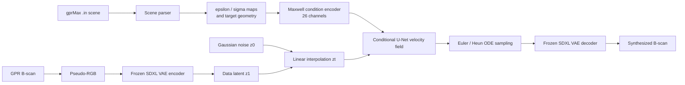

<div align="center">

# PCFlow

### Physics-Conditioned Rectified Flow for Ground-Penetrating Radar Imaging

[Project page](https://geometryfu.github.io/PCFlow/) · [中文说明](README_CN.md) · [Source](PCFlow/) · [Dataset summary](PCFlow/dataset_split/summary.json)


</div>

PCFlow synthesizes 1024 × 1024 ground-penetrating radar (GPR) B-scans from gprMax-style physical scene descriptions. It combines an analytic, Maxwell-informed 26-channel condition encoder with a conditional rectified-flow U-Net operating in the latent space of a frozen SDXL VAE.

> The executable project is in [`PCFlow/`](PCFlow/). Run all commands below from that directory.

## What is implemented

- **Physics-conditioned representation:** relative permittivity, conductivity, impedance, attenuation, phase, target geometry, travel-time curves, hyperbola response and target-strength priors are assembled into a 26-channel tensor.
- **Latent rectified flow:** grayscale radargrams are converted to pseudo-RGB, encoded to `4 × 128 × 128` SDXL-VAE latents, and learned as a straight velocity field from Gaussian noise to the data latent.
- **Physics-aware U-Net:** the condition is injected at multiple resolutions through grouped Physics-SPADE blocks; attention is applied at the 32 × 32 and 16 × 16 resolutions.
- **Training utilities:** mixed precision, gradient clipping, exponential moving average (EMA), classifier-free condition dropout, fixed validation samples, CSV logging, loss curves and periodic checkpoints.
- **Bundled benchmark:** 800 paired gprMax scene files and B-scan images, including train, validation, in-distribution test and stress-test splits plus few-shot subsets.

## Method at a glance



For training, the model samples `t ~ U(0, 1)`, constructs `z_t = (1-t) z_0 + t z_1`, and predicts the constant target velocity `v = z_1 - z_0`. The loss is MSE with a linear depth weight from 1.0 to 3.0 so deeper, weaker responses receive more emphasis.

## Repository layout

```text
PCFlow/                         # executable source root
├── configs/
│   ├── model_gpr.yaml          # VAE, U-Net and 26-channel encoder
│   ├── train_gpr.yaml          # main training preset
│   └── train_gpr_dataset_split.yaml
├── data/gpr_dataset/           # dataset, index builder and .in parser
├── dataset_split/              # bundled paired benchmark and split metadata
├── models/                     # condition encoder, U-Net, VAE and pseudo-RGB
├── utils/                      # solvers, EMA, logging, plotting and I/O
├── train.py                    # training entry point
├── sample.py                   # checkpoint sampling entry point
└── requirements.txt
docs/index.html                 # GitHub Pages project site
assets/                         # README figures
```

## Installation

Python 3.10 and a CUDA-capable PyTorch installation are recommended. Choose the PyTorch build appropriate for your CUDA version from the [official PyTorch installer](https://pytorch.org/get-started/locally/), then install the remaining dependencies.

```bash
git clone https://github.com/GeometryFu/PCFlow.git
cd PCFlow/PCFlow

conda create -n pcflow python=3.10 -y
conda activate pcflow

# Install the CUDA-enabled PyTorch build suitable for your system first.
pip install -r requirements.txt
```

The frozen VAE is loaded from `stabilityai/sdxl-vae` by default. For offline use, download it in advance and change `vae.pretrained_path` in [`configs/model_gpr.yaml`](PCFlow/configs/model_gpr.yaml) to the local directory.

## Dataset

The bundled dataset contains 800 paired samples:

| Split | Samples | Purpose |
|---|---:|---|
| `train` | 443 | Main training set and source for few-shot subsets |
| `val` | 88 | Velocity-loss validation and fixed visual samples |
| `test_id` | 70 | In-distribution evaluation |
| `stress_test` | 199 | High-conductivity stress testing |

Target classes are `steel_free_space` (403), `pvc_water` (204), and `pvc_free_space` (193). See [`summary.json`](PCFlow/dataset_split/summary.json) for the complete statistics.

Each JSONL record pairs a radargram with a gprMax scene:

```json
{
  "id": "pvc_free_space_r0.03_eps10_sig0.005_x1.27_y0.4",
  "image_path": "dataset_split/images/train/pvc_free_space_r0.03_eps10_sig0.005_x1.27_y0.4.png",
  "in_path": "dataset_split/conditions/train/pvc_free_space_r0.03_eps10_sig0.005_x1.27_y0.4.in"
}
```

To index a similarly structured custom dataset:

```bash
python data/gpr_dataset/build_index.py \
  --images_dir path/to/images \
  --ins_dir path/to/conditions \
  --out_jsonl path/to/train.jsonl
```

Then update the paths under `data` in a training YAML file. Image and `.in` filenames must share the same stem.

## Training

### 1. Select configuration

- [`configs/model_gpr.yaml`](PCFlow/configs/model_gpr.yaml) defines the SDXL VAE, U-Net and physical encoder.
- [`configs/train_gpr.yaml`](PCFlow/configs/train_gpr.yaml) is the main 50,000-step preset: batch size 8, AdamW at `5e-5`, AMP, EMA `0.999`, 10% condition dropout and 50-step Heun validation sampling.
- [`configs/train_gpr_dataset_split.yaml`](PCFlow/configs/train_gpr_dataset_split.yaml) is an alternate preset with learning rate `1e-4`, 30-step Heun sampling and a separate output directory.

Adjust `batch_size` and `num_workers` for your machine before starting.

### 2. Start training

```bash
# Main preset
python train.py

# Explicit configuration files
python train.py \
  --model-config configs/model_gpr.yaml \
  --train-config configs/train_gpr_dataset_split.yaml
```

The current entry point is single-process and uses the device declared in the training YAML (`cuda` by default).

### 3. Monitor artifacts

Artifacts are written under `output.workdir`:

```text
outputs/gpr_cfm/
├── checkpoints/     # ckpt_XXXXXXX.pt
├── samples_fixed/   # repeated validation cases for visual comparison
├── metrics/         # train_log.csv and fixed_val_indices.json
└── curves/          # loss_curve.png
```

Logging occurs every 50 steps, fixed samples every 500 steps, and validation/checkpointing every 1,000 steps in the main preset.

### 4. Resume

Edit the `resume` block in the selected training YAML:

```yaml
train:
  resume:
    enabled: true
    checkpoint_path: "ckpt_0010000.pt"  # null selects the newest checkpoint
```

The current implementation restores the U-Net, EMA weights and step counter. Optimizer and AMP-scaler states are stored in checkpoints but are not restored by `setup_resume_training`.

## Sampling

Use an EMA checkpoint with either an explicit pair or a JSONL file:

```bash
# Explicit paired files
python sample.py \
  --ckpt outputs/gpr_cfm/checkpoints/ckpt_0050000.pt \
  --image dataset_split/images/test_id/steel_free_space_r0.08_eps10_sig0.005_x2.29_y0.65.png \
  --infile dataset_split/conditions/test_id/steel_free_space_r0.08_eps10_sig0.005_x2.29_y0.65.in \
  --out outputs/sample.png

# The current sampler reads the first record in the JSONL file
python sample.py \
  --ckpt outputs/gpr_cfm/checkpoints/ckpt_0050000.pt \
  --jsonl dataset_split/jsonl/test_id.jsonl \
  --out outputs/sample.png
```

The standalone sampler uses the solver name and step count in the selected training configuration. Its current CLI expects a paired image path together with the `.in` path (or obtains both from JSONL).

## Implementation notes

- The source currently targets one cylindrical buried object per scene, matching the bundled dataset convention.
- Model training uses an edge-preserving condition downsampler; the standalone sampler currently uses average pooling for its condition tensor.
- Physics Flow Alignment (PFA) modules are defined for checkpoint compatibility but disabled in `ResBlock.forward`; active conditioning is provided by concatenation and Physics-SPADE.
- No pretrained PCFlow checkpoint or paper identifier is published in this repository at present, so this README does not advertise placeholder links.

## License

The repository currently contains two different license notices: the root [`LICENSE`](LICENSE) is Apache-2.0, while [`PCFlow/LICENSE`](PCFlow/LICENSE) states CC-BY-NC-4.0 for the source and bundled dataset. Please confirm the intended terms with the project authors before reuse.

## Citation

No publication metadata is included in the repository yet. If you use the code, cite the repository URL and commit hash until an official citation is provided.
