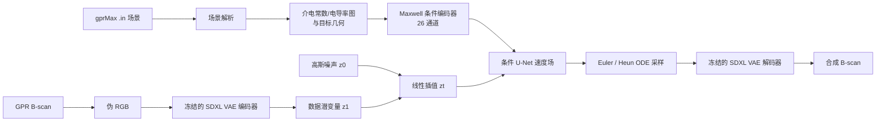

<div align="center">

# PCFlow

### 面向探地雷达成像的物理条件整流流模型

[项目主页](https://geometryfu.github.io/PCFlow/) · [English](README.md) · [项目源码](PCFlow/) · [数据集统计](PCFlow/dataset_split/summary.json)


</div>

PCFlow 根据 gprMax 风格的物理场景描述生成 1024 × 1024 探地雷达（GPR）B-scan。模型将解析得到的电磁材料和目标几何信息编码为 26 通道 Maxwell 物理条件，并在冻结的 SDXL VAE 潜空间中训练条件整流流 U-Net。

> 可执行源码位于 [`PCFlow/`](PCFlow/)，下文命令均需在该目录中运行。

## 已实现功能

- **物理条件编码：** 将相对介电常数、电导率、阻抗、衰减、相位、管线几何、传播时间曲线、双曲响应与目标强度先验组织为 26 通道条件张量。
- **潜空间整流流：** 将灰度雷达图转换为伪 RGB，经 SDXL VAE 编码为 `4 × 128 × 128` 潜变量，并学习从高斯噪声到数据潜变量的直线速度场。
- **物理感知 U-Net：** 通过分组 Physics-SPADE 在多个分辨率注入条件，并在 32 × 32 和 16 × 16 特征上使用注意力。
- **完整训练设施：** 混合精度、梯度裁剪、指数滑动平均（EMA）、Classifier-Free 条件丢弃、固定验证样本、CSV 日志、损失曲线与周期检查点。
- **内置数据集：** 800 组 gprMax 场景与 B-scan 配对数据，包含训练、验证、同分布测试、压力测试以及少样本子集。

## 方法流程



训练时采样 `t ~ U(0, 1)`，构造 `z_t = (1-t) z_0 + t z_1`，目标速度为 `v = z_1 - z_0`。损失采用 MSE，并沿深度方向将权重从 1.0 线性提高到 3.0，以增强对深部弱响应的关注。

## 目录结构

```text
PCFlow/                         # 可执行源码根目录
├── configs/                    # 模型与训练 YAML 配置
├── data/gpr_dataset/           # 数据集、索引构建器与 .in 解析器
├── dataset_split/              # 内置配对数据与划分元数据
├── models/                     # 条件编码器、U-Net、VAE、伪 RGB
├── utils/                      # 求解器、EMA、日志、绘图与 I/O
├── train.py                    # 训练入口
├── sample.py                   # 检查点采样入口
└── requirements.txt
docs/index.html                 # GitHub Pages 项目页
assets/                         # README 图片
```

## 环境安装

推荐使用 Python 3.10 和支持 CUDA 的 PyTorch。请先根据本机 CUDA 版本从 [PyTorch 官方安装页](https://pytorch.org/get-started/locally/) 选择安装命令，再安装其余依赖。

```bash
git clone https://github.com/GeometryFu/PCFlow.git
cd PCFlow/PCFlow

conda create -n pcflow python=3.10 -y
conda activate pcflow

# 先安装与本机 CUDA 匹配的 PyTorch
pip install -r requirements.txt
```

默认从 `stabilityai/sdxl-vae` 加载冻结的 VAE。离线训练时，请提前下载模型，并将 [`configs/model_gpr.yaml`](PCFlow/configs/model_gpr.yaml) 中的 `vae.pretrained_path` 改为本地目录。

## 数据集

内置数据集共 800 组样本：

| 划分 | 数量 | 用途 |
|---|---:|---|
| `train` | 443 | 主训练集与少样本子集来源 |
| `val` | 88 | 速度损失验证与固定可视化样本 |
| `test_id` | 70 | 同分布测试 |
| `stress_test` | 199 | 高电导率压力测试 |

目标类别包括 `steel_free_space`（403）、`pvc_water`（204）和 `pvc_free_space`（193）。完整统计见 [`summary.json`](PCFlow/dataset_split/summary.json)。

JSONL 中每条记录将一张雷达图与一个 gprMax 场景配对：

```json
{
  "id": "pvc_free_space_r0.03_eps10_sig0.005_x1.27_y0.4",
  "image_path": "dataset_split/images/train/pvc_free_space_r0.03_eps10_sig0.005_x1.27_y0.4.png",
  "in_path": "dataset_split/conditions/train/pvc_free_space_r0.03_eps10_sig0.005_x1.27_y0.4.in"
}
```

为同类自定义数据建立索引：

```bash
python data/gpr_dataset/build_index.py \
  --images_dir path/to/images \
  --ins_dir path/to/conditions \
  --out_jsonl path/to/train.jsonl
```

图片和 `.in` 文件必须同名（扩展名除外），随后在训练 YAML 的 `data` 段修改 JSONL 路径。

## 训练流程

### 1. 选择配置

- [`configs/model_gpr.yaml`](PCFlow/configs/model_gpr.yaml)：SDXL VAE、U-Net 和 26 通道物理编码器。
- [`configs/train_gpr.yaml`](PCFlow/configs/train_gpr.yaml)：主实验配置；50,000 步、batch size 8、AdamW 学习率 `5e-5`、AMP、EMA `0.999`、10% 条件丢弃、50 步 Heun 验证采样。
- [`configs/train_gpr_dataset_split.yaml`](PCFlow/configs/train_gpr_dataset_split.yaml)：备选配置；学习率 `1e-4`、30 步 Heun 采样，并使用独立输出目录。

启动前请根据设备显存和 CPU 数量调整 `batch_size` 与 `num_workers`。

### 2. 启动训练

```bash
# 主配置
python train.py

# 显式指定模型与训练配置
python train.py \
  --model-config configs/model_gpr.yaml \
  --train-config configs/train_gpr_dataset_split.yaml
```

当前训练入口为单进程程序，使用训练 YAML 中声明的设备（默认 `cuda`）。

### 3. 查看训练产物

产物写入 `output.workdir`：

```text
outputs/gpr_cfm/
├── checkpoints/     # ckpt_XXXXXXX.pt
├── samples_fixed/   # 固定验证样本，便于跨步骤比较
├── metrics/         # train_log.csv、fixed_val_indices.json
└── curves/          # loss_curve.png
```

主配置每 50 步记录一次训练日志，每 500 步生成固定样本，每 1,000 步验证并保存检查点。

### 4. 断点续训

修改当前训练 YAML：

```yaml
train:
  resume:
    enabled: true
    checkpoint_path: "ckpt_0010000.pt"  # null 表示自动选择最新检查点
```

当前实现会恢复 U-Net、EMA 权重和步数。检查点中虽然保存了优化器与 AMP scaler 状态，但 `setup_resume_training` 目前不会恢复这两项状态。

## 生成与推理

可通过显式配对文件或 JSONL 使用 EMA 检查点：

```bash
# 显式指定配对文件
python sample.py \
  --ckpt outputs/gpr_cfm/checkpoints/ckpt_0050000.pt \
  --image dataset_split/images/test_id/steel_free_space_r0.08_eps10_sig0.005_x2.29_y0.65.png \
  --infile dataset_split/conditions/test_id/steel_free_space_r0.08_eps10_sig0.005_x2.29_y0.65.in \
  --out outputs/sample.png

# 当前脚本读取 JSONL 的第一条记录
python sample.py \
  --ckpt outputs/gpr_cfm/checkpoints/ckpt_0050000.pt \
  --jsonl dataset_split/jsonl/test_id.jsonl \
  --out outputs/sample.png
```

独立采样脚本使用所选训练配置中的求解器和步数。当前命令行接口要求同时提供配对图片与 `.in` 文件，或从 JSONL 中取得二者。

## 实现说明

- 当前源码以单个圆柱形埋地目标为主要场景，与内置数据集约定一致。
- 训练使用边缘保持的条件降采样；独立采样脚本目前使用平均池化。
- Physics Flow Alignment（PFA）模块已定义以保持检查点兼容，但在 `ResBlock.forward` 中默认关闭；当前条件注入由输入拼接与 Physics-SPADE 完成。
- 仓库目前没有发布 PCFlow 预训练权重或正式论文编号，因此文档不再保留占位链接。

## 许可证

仓库中目前存在两份不一致的许可证说明：根目录 [`LICENSE`](LICENSE) 为 Apache-2.0，而 [`PCFlow/LICENSE`](PCFlow/LICENSE) 声明源码和内置数据集采用 CC-BY-NC-4.0。复用前请向项目作者确认最终许可条款。

## 引用

仓库暂未提供正式论文元数据。在官方引用信息发布前，使用本项目时可引用仓库 URL 与具体 commit hash。
